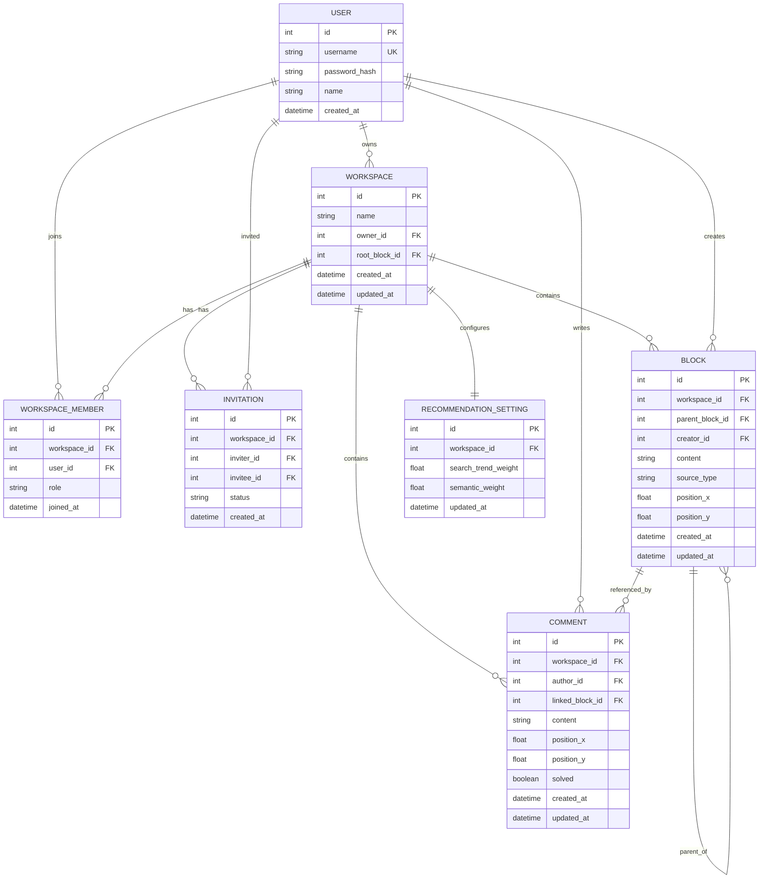

# 26s-w1-c2-01

## 공통과제 I : 웹 기반 프로젝트 (2인 1팀)

**목적:** 공통 과제를 함께 수행하며 웹 개발의 전체 흐름을 빠르게 익히고 협업에 적응하기

**결과물:** 기획부터 배포까지 완료된 웹 서비스와 관련 문서 일체

---

## 팀원

| 이름 | GitHub | 역할 |
|---|---|---|
|양우현|hyun020215|  |
|김경원|kkw610|  |

---

## 기획안

- **주제:** 온라인 브레인스토밍 협업 툴
- **목적:** 웹 상에서 팀원들과 함께 자유롭게 의견을 나누고 브레인스토밍을 할 수 있도록 검색, 공유, 추천, 커스터마이징 등의 기능으로 사용자 보조
- **핵심 컨셉:** 하나의 워크스페이스 = 하나의 브레인스토밍 캔버스. 루트 노드에서 시작해 팀원들이 함께 아이디어 블록을 트리 형태로 확장하며, 모든 변경사항은 **실시간으로 동기화**됨
- **예상 사용자:** Ideation이 필요한 학생, 직장인 등

---

## 기능 명세서

### 필수 기능

- [ ] 회원가입 / 로그인 (ID + PW, JWT 기반 인증)
- [ ] 워크스페이스 생성 / 목록 조회 / 수정 / 삭제
- [ ] 유저 ID 검색 및 워크스페이스 초대 / 수락·거절
- [ ] 아이디어 블록 생성 / 연결(재연결) / 삭제 / 위치 이동
- [ ] **워크스페이스 내 실시간 동기화** (WebSocket) — 협업 툴의 전제 조건이므로 필수로 격상 권장
  - 블록 생성/삭제/이동/재연결이 다른 팀원 화면에 즉시 반영

### 선택 기능

- [ ] 자동 추천 (관련검색어 기반 / 사전적 유사어 기반)
- [ ] 추천 우선순위 커스터마이징 (검색어 가중치 vs 유사어 가중치)
- [ ] 피그마식 위치 기반 코멘트 (캔버스 좌표에 메모 핀 남기기, 해결 처리)

---

## IA 및 화면 설계서

> 서비스의 전체 페이지 구조와 페이지 간 이동 흐름 정리 예정

- 로그인/회원가입 페이지
- 워크스페이스 목록/초대함 페이지
- 브레인스토밍 캔버스 페이지 (블록 트리 + 코멘트 핀 + 추천 패널)

<!-- Figma 링크 또는 이미지 첨부 -->

---

## DB 스키마

### ERD



### 테이블 상세

**User**
| 필드 | 타입 | 설명 |
|---|---|---|
| id | PK | |
| username | string, unique | 로그인 ID |
| password_hash | string | bcrypt/argon2 해시 |
| name | string | 표시 이름 |
| created_at | datetime | |

**Workspace**
| 필드 | 타입 | 설명 |
|---|---|---|
| id | PK | |
| name | string | |
| owner_id | FK(User) | 생성자 |
| root_block_id | FK(Block), nullable | 최초 루트 블록 |
| created_at / updated_at | datetime | |

> 원본 초안의 `creator`, `userID` 중복 FK를 제거하고, 다대다 관계는 아래 `WorkspaceMember`로 분리했습니다.

**WorkspaceMember** *(신규)*
| 필드 | 타입 | 설명 |
|---|---|---|
| id | PK | |
| workspace_id | FK(Workspace) | |
| user_id | FK(User) | |
| role | string | owner / member |
| joined_at | datetime | |

**Invitation** *(신규 — API 문서엔 있었으나 스키마 누락)*
| 필드 | 타입 | 설명 |
|---|---|---|
| id | PK | |
| workspace_id | FK(Workspace) | |
| inviter_id | FK(User) | |
| invitee_id | FK(User) | |
| status | string | pending / accepted / rejected |
| created_at | datetime | |

**Block**
| 필드 | 타입 | 설명 |
|---|---|---|
| id | PK | |
| workspace_id | FK(Workspace) | |
| parent_block_id | FK(Block), nullable | 트리 구조 |
| creator_id | FK(User) | 누가 만들었는지 |
| content | string | 아이디어 워딩 |
| source_type | string | manual / recommended |
| position_x / position_y | float | 캔버스 좌표 (드래그 이동용) |
| created_at / updated_at | datetime | |

**Comment** *(위치 기반으로 재설계)*
| 필드 | 타입 | 설명 |
|---|---|---|
| id | PK | |
| workspace_id | FK(Workspace) | 캔버스 단위로 소속 |
| author_id | FK(User) | |
| linked_block_id | FK(Block), nullable | 특정 블록 근처에 달린 경우만 참조 |
| content | string | |
| position_x / position_y | float | 캔버스 상 코멘트 핀 좌표 |
| solved | boolean | |
| created_at / updated_at | datetime | |

> 기존엔 `/blocks/{blockID}/comments`로 블록에 종속되어 있었는데, "피그마처럼 원하는 영역에" 라는 요구사항과 맞지 않아 워크스페이스 캔버스 좌표 기반으로 변경했습니다.

**RecommendationSetting**
| 필드 | 타입 | 설명 |
|---|---|---|
| id | PK | |
| workspace_id | FK(Workspace), unique | |
| search_trend_weight | float (0~1) | 관련검색어 기반 추천 가중치 |
| semantic_weight | float (0~1) | 사전적 유사어 기반 추천 가중치 |
| updated_at | datetime | |

> 원안의 `creativity / feasibility / relevance`는 "창의성/실현가능성" 축이라 실제 설명하신 "관련검색어 vs 사전적 유사성" 추천 소스와 안 맞아서 두 축으로 단순화했습니다.

---

## API 문서

### Auth
| Method | Endpoint | 설명 | 요청 | 응답 |
|---|---|---|---|---|
| POST | `/api/v1/auth/signup` | 회원가입 | `id`, `password`, `name` | `userId`, `id`, `name` |
| POST | `/api/v1/auth/login` | 로그인 | `id`, `password` | `accessToken`, `refreshToken`, `user` |
| POST | `/api/v1/auth/refresh` | 토큰 재발급 | `refreshToken` | `accessToken` |
| POST | `/api/v1/auth/logout` | 로그아웃 | 없음 | `message` |

### User
| Method | Endpoint | 설명 | 요청 | 응답 |
|---|---|---|---|---|
| GET | `/api/v1/users/me` | 내 정보 조회 | 없음 | `userId`, `id`, `name` |
| GET | `/api/v1/users/search` | 유저 ID 검색 (초대용) | `q` (query param) | `users[]` |

### Workspace / Member / Invitation
| Method | Endpoint | 설명 | 요청 | 응답 |
|---|---|---|---|---|
| POST | `/api/v1/workspaces` | 워크스페이스 생성 | `name` | `workspace` |
| GET | `/api/v1/workspaces` | 내 워크스페이스 목록 | 없음 | `workspaces[]` |
| GET | `/api/v1/workspaces/{workspaceId}` | 상세 조회 | 없음 | `workspace`, `members[]` |
| PATCH | `/api/v1/workspaces/{workspaceId}` | 수정 | `name` | `workspace` |
| DELETE | `/api/v1/workspaces/{workspaceId}` | 삭제 | 없음 | `message` |
| POST | `/api/v1/workspaces/{workspaceId}/invite` | 초대 | `userId` | `invitation` |
| GET | `/api/v1/workspaces/{workspaceId}/members` | 멤버 목록 | 없음 | `members[]` |
| DELETE | `/api/v1/workspaces/{workspaceId}/members/{userId}` | 멤버 제거 | 없음 | `message` |
| GET | `/api/v1/invitations` | 받은 초대 목록 | 없음 | `invitations[]` |
| POST | `/api/v1/invitations/{invitationId}/accept` | 초대 수락 | 없음 | `message` |
| POST | `/api/v1/invitations/{invitationId}/reject` | 초대 거절 | 없음 | `message` |

### Block
| Method | Endpoint | 설명 | 요청 | 응답 |
|---|---|---|---|---|
| POST | `/api/v1/workspaces/{workspaceId}/blocks` | 블록 생성 | `content`, `parentBlockId?`, `positionX`, `positionY` | `block` |
| GET | `/api/v1/workspaces/{workspaceId}/blocks` | 전체 블록 트리 조회 | 없음 | `blocks[]` |
| GET | `/api/v1/blocks/{blockId}` | 블록 상세 | 없음 | `block` |
| PATCH | `/api/v1/blocks/{blockId}` | 내용 수정 | `content` | `block` |
| PATCH | `/api/v1/blocks/{blockId}/position` | 위치 이동 | `positionX`, `positionY` | `block` |
| PATCH | `/api/v1/blocks/{blockId}/parent` | 연결/부모 변경 | `parentBlockId` 또는 `null` | `block` |
| DELETE | `/api/v1/blocks/{blockId}` | 삭제 | 없음 | `message` |

### Comment *(선택 기능)*
| Method | Endpoint | 설명 | 요청 | 응답 |
|---|---|---|---|---|
| POST | `/api/v1/workspaces/{workspaceId}/comments` | 코멘트 생성 | `content`, `positionX`, `positionY`, `linkedBlockId?` | `comment` |
| GET | `/api/v1/workspaces/{workspaceId}/comments` | 코멘트 목록 | 없음 | `comments[]` |
| PATCH | `/api/v1/comments/{commentId}` | 수정 | `content` | `comment` |
| PATCH | `/api/v1/comments/{commentId}/solved` | 해결 여부 변경 | `solved` | `comment` |
| DELETE | `/api/v1/comments/{commentId}` | 삭제 | 없음 | `message` |

### Recommendation *(선택 기능)*
| Method | Endpoint | 설명 | 요청 | 응답 |
|---|---|---|---|---|
| GET | `/api/v1/blocks/{blockId}/recommendations` | 해당 블록 기반 추천 결과 조회 (캐시 or 재요청) | `limit?` | `recommendations[]` |
| POST | `/api/v1/blocks/{blockId}/recommendations/apply` | 추천 항목을 실제 블록으로 확정 | `content` | `block` |
| GET | `/api/v1/workspaces/{workspaceId}/recommendation-settings` | 우선순위 설정 조회 | 없음 | `settings` |
| PATCH | `/api/v1/workspaces/{workspaceId}/recommendation-settings` | 우선순위 설정 수정 | `searchTrendWeight`, `semanticWeight` | `settings` |

### WebSocket
| Endpoint | 설명 |
|---|---|
| `WS /api/v1/ws/workspaces/{workspaceId}` | 워크스페이스 단위 실시간 채널 (접속 시 JWT 인증) |

**이벤트 타입** *(신규 정의)*

| 이벤트 | 발생 시점 | 페이로드 |
|---|---|---|
| `block:created` | 블록 생성 | `block` |
| `block:updated` | 내용/위치 수정 | `block` |
| `block:reparented` | 재연결 | `block` |
| `block:deleted` | 삭제 | `blockId` |
| `comment:created` / `comment:resolved` / `comment:deleted` | 코멘트 CRUD | `comment` |
| `recommendation:ready` | Celery 추천 작업 완료 | `blockId`, `recommendations[]` |
| `member:joined` / `member:left` | 접속 상태 | `userId` |

---

## 추천 기능 동작 흐름 *(신규 정의)*

1. 사용자가 블록 생성(`POST /blocks`) → API는 즉시 블록을 반환하고, Celery에 추천 생성 태스크를 비동기로 위임
2. Celery worker가 `RecommendationSetting`의 가중치를 참고해
   - **관련검색어**: 검색 포털의 연관검색어/자동완성 API 호출
   - **사전적 유사성**: 임베딩 모델 또는 유의어 사전 API로 유사어 계산
   - 두 결과를 가중치 비율로 합산·정렬
3. 결과를 Redis에 `block:{blockId}:recommendations` 키로 TTL 캐싱
4. WebSocket으로 `recommendation:ready` 이벤트 브로드캐스트 → 프론트는 해당 블록 옆에 "추천 후보" 프리뷰 노드 표시
5. 사용자가 후보 클릭 → `POST /blocks/{id}/recommendations/apply` → 실제 Block 레코드 생성 및 `block:created` 이벤트 브로드캐스트

> 크롤링 대신, 시간이 촉박하다면 네이버 검색 API(연관검색어) + 사전 API(우리말샘/표준국어대사전) 같은 공식 API를 쓰는 걸 권장합니다. 직접 크롤러를 만들면 유지보수 비용이 커서 2인 팀 일정상 부담이 될 수 있습니다.

---

## 기술 스택 추천

기본 골격(FastAPI + PostgreSQL + Redis + Celery + WebSocket)은 이 프로젝트 구조와 잘 맞습니다. 역할을 명확히 하면:

| 영역 | 스택 | 이유 |
|---|---|---|
| API 서버 | **FastAPI** (async) | Pydantic 스키마로 API 문서(`/docs`) 자동 생성, WebSocket 네이티브 지원 |
| ORM / 마이그레이션 | **SQLAlchemy 2.0 (async) + Alembic** | 비동기 FastAPI와 궁합, 트리 구조는 `parent_block_id` self-FK로 충분 (재귀 CTE로 서브트리 조회) |
| DB | **PostgreSQL** | 관계형 구조(User-Workspace-Block-Comment)에 적합, `recursive CTE`로 블록 트리 조회 용이 |
| 캐시/큐 | **Redis** | (1) Celery 브로커/백엔드 (2) 추천 결과 TTL 캐싱 (3) 다중 서버 확장 시 WebSocket pub/sub 백본 |
| 비동기 작업 | **Celery** | 추천 생성(외부 API 호출 포함)을 요청-응답 흐름에서 분리, 완료 시 WebSocket으로 push |
| 실시간 동기화 | **WebSocket** (FastAPI native) | 블록 CRUD·코멘트·추천·접속상태 모두 양방향이 필요해 SSE보다 WebSocket 단일화 권장. SSE는 별도로 안 써도 무방 |
| 인증 | **JWT (access + refresh) + passlib(bcrypt)** | ID/PW 로그인, 토큰 기반 stateless 인증 |
| 프론트엔드 | **React + TypeScript** | |
| 캔버스/노드 UI | **React Flow** | 드래그 가능한 노드-엣지 그래프를 직접 구현하지 않아도 됨, 블록 트리 시각화에 최적 |
| 상태관리 | **Zustand** (또는 Redux Toolkit) | 실시간 이벤트로 자주 갱신되는 캔버스 상태 관리에 가벼움 |
| 스타일 | **TailwindCSS** | |
| 배포 | **Docker Compose** (FastAPI + Postgres + Redis + Celery worker) → Railway/Render/Fly.io 또는 단일 VM | 2인 팀 일정상 K8s 등 과설계는 지양, Compose로 로컬/배포 환경 일치 |

**보완 제안**
- `python-jose` 또는 `pyjwt`로 JWT 발급, `passlib[bcrypt]`로 비밀번호 해싱
- 블록 트리가 커질 경우 `GET /workspaces/{id}/blocks`는 PostgreSQL `WITH RECURSIVE` CTE로 서브트리 통째로 조회
- WebSocket 연결 관리는 workspace_id 별 Connection Manager(딕셔너리)로 단일 서버 기준 구현 → 추후 다중 서버 확장 시 Redis Pub/Sub으로 브로드캐스트 전환

---

## 배포 결과물

- **서비스 URL:**
- **실행 방법:**

```bash
# 실행 방법 작성
```

---

## 회고 문서

### Keep

### Problem

### Try

---

## 참고 자료

- [SDD(스펙 주도 개발) 이해하기](https://news.hada.io/topic?id=21338)
- [Software Design Document Best Practices](https://www.atlassian.com/work-management/project-management/design-document)
- [IA 정보구조도 작성 방법](https://brunch.co.kr/@nyonyo/7)
- [기획자 화면설계서 작성법](https://brunch.co.kr/@soup/10)
- [Figma 와이어프레임 가이드](https://www.figma.com/ko-kr/resource-library/what-is-wireframing/)
- [무료 Figma 와이어프레임 키트](https://www.figma.com/ko-kr/templates/wireframe-kits/)
- [ERD/DB 설계 총정리](https://inpa.tistory.com/entry/DB-%F0%9F%93%9A-%EB%8D%B0%EC%9D%B4%ED%84%B0-%EB%AA%A8%EB%8D%B8%EB%A7%81-%EA%B0%9C%EB%85%90-ERD-%EB%8B%A4%EC%9D%B4%EC%96%B4%EA%B7%B8%EB%9E%A8)
- [API 명세서 작성 가이드라인](https://velog.io/@sebinChu/BackEnd-API-%EB%AA%85%EC%84%B8%EC%84%9C-%EC%9E%91%EC%84%B1-%EA%B0%80%EC%9D%B4%EB%93%9C-%EB%9D%BC%EC%9D%B8)
- [좋은 README 작성하는 방법](https://velog.io/@sabo/good-readme)
- [단기 프로젝트 회고 KPT 방법론](https://velog.io/@habwa/%EB%8B%A8%EA%B8%B0-%ED%94%84%EB%A1%9C%EC%A0%9D%ED%8A%B8-%ED%9A%8C%EA%B3%A0-KPT-%EB%B0%A9%EB%B2%95%EB%A1%A0)
