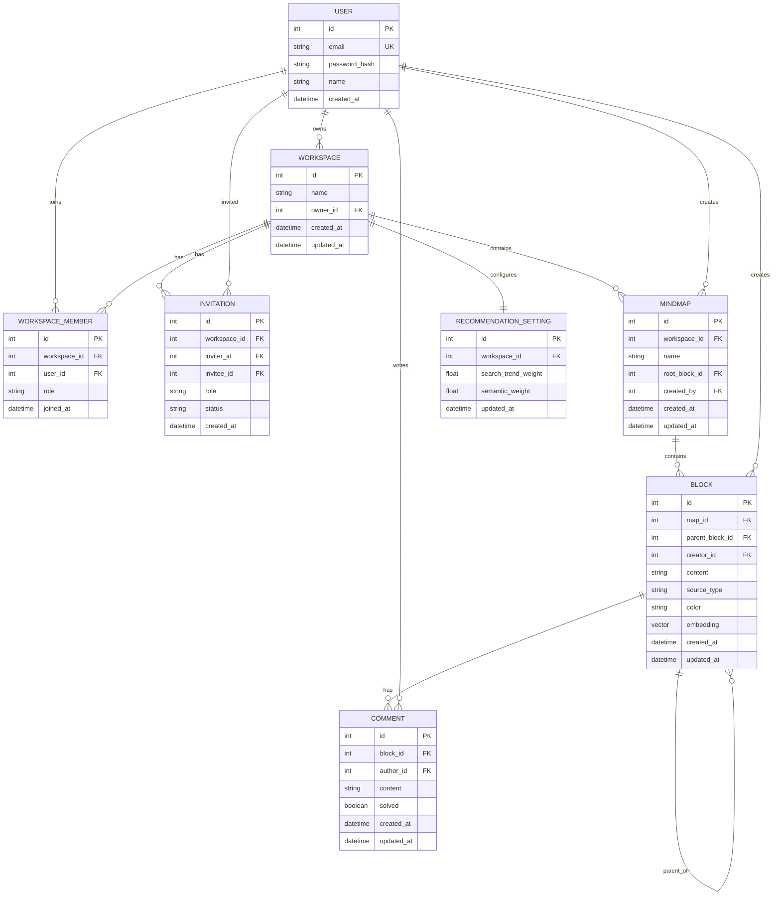

# 26s-w1-c2-01 : CoMind

## 공통과제 I : 웹 기반 프로젝트 (2인 1팀)

**목적:** 공통 과제를 함께 수행하며 웹 개발의 전체 흐름을 빠르게 익히고 협업에 적응하기

**결과물:** 기획부터 배포까지 완료된 웹 서비스와 관련 문서 일체

---

## 팀원

| 이름 | GitHub | 역할 |
|---|---|---|
|양우현|[@hyun020215](https://github.com/hyun020215)| 디자인, Frontend 전반, QA, CI/CD |
|김경원|[@kkw610](https://github.com/kkw610)| API 문서화, 추천 알고리즘 설계, Backend 전반, QA |

---

## 기획안

- **주제:** 온라인 브레인스토밍 협업 툴 (CoMind)
- **목적:** 팀원들이 하나의 워크스페이스 안에서 여러 개의 브레인스토밍 트리(마인드맵)를 만들고, 아이디어 블록을 실시간으로 함께 확장하며, 자동 추천과 노드별 코멘트로 아이디어 발산을 돕는다.
- **핵심 기능:** 워크스페이스 하나에 마인드맵을 여러 개 만들 수 있고, 각 마인드맵은 루트 노드에서 시작해 팀원들이 함께 블록을 트리 형태로 확장한다. 블록 생성 시 AI가 맥락을 반영해 다음 아이디어를 추천하고, 모든 변경사항은 실시간으로 동기화된다.
- **예상 사용자:** Ideation이 필요한 학생, 직장인 등
- **차별점:** 단순 마인드맵 툴이 아니라, 블록 생성 시점마다 지금까지의 트리 구조(상위 노드, 같은 색상 그룹)를 함께 참고해 다음 아이디어를 자동 추천해준다.

---

## 기능 명세서

### 필수 기능

- [x] 회원가입 / 로그인 — 아이디(이메일 형식 문자열, 실제 인증 메일 발송·형식 검증 없음) + 비밀번호(영문·숫자·특수문자 포함 8자 이상), 이메일 중복·비밀번호 조건 실시간 확인, JWT 기반 인증
- [x] 내 프로필 수정 — 프로필 메뉴 모달에서 닉네임/비밀번호 변경(비밀번호는 현재 비밀번호 확인 필수), 변경 시 다른 접속자에게 실시간 반영
- [x] 회원 탈퇴 (소유한 워크스페이스가 있으면 먼저 정리하도록 안내)
- [x] 워크스페이스 생성 / 이름 변경 / 삭제
- [x] 워크스페이스 멤버 권한 3단계 (owner / editor / viewer) — viewer는 읽기 전용
- [x] 유저 검색(아이디 기준) 및 워크스페이스 초대 / 수락·거절
- [x] 워크스페이스 내 마인드맵(브레인스토밍 트리) 생성/이름변경/삭제 — 생성 시 이름과 동일한 루트 블록 자동 생성
- [x] 아이디어 블록 생성 / 다른 사람이 만든 블록에 연결(재연결) / 삭제 — 삭제 시 하위 서브트리 전체 함께 삭제, 사이클(자기 자손을 부모로 지정) 방지
- [x] 아이디어 블록 색상 지정 (8가지 프리셋, 기본값은 부모 색상 상속)
- [x] 워크스페이스/마인드맵 단위 실시간 동기화 (WebSocket) — 블록·코멘트·추천 결과·멤버 변화가 모든 접속자에게 즉시 반영

### 선택 기능 (차별화 기능)

- [x] 자동 추천 — 블록 생성 시 해당 워딩과 상위 노드·같은 색상 그룹 맥락을 반영해 Gemini API가 관련 키워드를 추천. 관련검색어 API를 폴백으로 사용
- [x] 추천받은 블록 클릭으로 바로 생성 / 수동 블록 생성 둘 다 지원
- [x] 노드(블록) 단위 코멘트 — 선택한 노드의 코멘트를 사이드바에서 확인, 해결(resolved) 처리
- [x] 실시간 프레즌스 — 같은 마인드맵을 보고 있는 팀원과, 각자 지금 선택 중인 노드를 표시

---

## IA 및 화면 설계서

### 화면 구조

```
LoginScreen (로그인/회원가입)
   └─ WorkspaceScreen (워크스페이스 목록 + 마인드맵 목록)
         ├─ ShareModal (초대: 아이디 검색 + 역할 지정)
         ├─ CreateWorkspaceModal / CreateMindMapModal
         ├─ RenameModal / ConfirmModal (이름변경/삭제 공용)
         ├─ ProfileModal (내 프로필: 닉네임/비밀번호 수정, 배경 블러 처리된 중앙 모달)
         ├─ DeleteAccountModal (회원 탈퇴)
         ├─ InvitationScreen (받은 초대함, 수락/거절)
         └─ CanvasScreen (마인드맵 캔버스)
               ├─ 좌측: 노드 트리 캔버스 (MindNode 컴포넌트, 드래그/연결/삭제)
               ├─ 우측 패널: "노드 조작"(색상·추천) / "댓글"(CommentPanel) 토글
               └─ ShareModal / RenameModal / ConfirmModal / ProfileModal 재사용
```

### 화면별 주요 동작

| 화면 | 주요 UI | 사용자 행동 |
|---|---|---|
| LoginScreen | 아이디/비밀번호 입력, 로그인·회원가입 토글 | 로그인 또는 회원가입 후 워크스페이스 목록으로 이동 |
| WorkspaceScreen | 워크스페이스 목록, 마인드맵 카드(이름/노드 수/수정시각) | 워크스페이스 생성, 마인드맵 생성/진입, 초대·회원탈퇴 |
| InvitationScreen | 받은 초대 목록 | 수락 시 워크스페이스 멤버로 편입, 거절 시 목록에서 제거 |
| CanvasScreen | 블록 트리, 노드 조작 패널, 댓글 패널 | 블록 생성/연결/삭제/색상 변경, 추천 후보 확인 및 적용, 코멘트 작성/해결 |

---

## DB 스키마

### ERD



### 테이블 설명

**User** — 로그인 식별자는 이메일 형식 문자열이지만 인증 메일 발송이나 형식 검증은 하지 않는다. 회원 탈퇴 시 row를 삭제하지 않고 `email`/`name`/`password_hash`를 비식별화만 한다 (다른 사용자가 만든 블록·코멘트의 작성자 FK가 깨지지 않도록).

**Workspace / WorkspaceMember / Invitation** — 멤버 권한은 `owner`(전권) / `editor`(쓰기) / `viewer`(읽기 전용) 3단계. 초대는 `editor`/`viewer`로만 가능하며 수락 시 `WorkspaceMember`가 생성된다.

**MindMap** — 워크스페이스 하나에 여러 개 생성 가능. 생성 시 같은 이름의 루트 `Block`이 같은 트랜잭션에서 함께 생성되고 `root_block_id`가 채워진다.

**Block** — 트리 구조는 `parent_block_id` 자기참조 FK로 표현하며, `ON DELETE CASCADE`로 걸려 있어 부모 삭제 시 하위 서브트리 전체가 DB 레벨에서 자동 삭제된다. `color`는 8가지 프리셋(`indigo`/`violet`/`cyan`/`emerald`/`amber`/`red`/`pink`/`blue`)만 허용하는 CHECK 제약이 걸려 있다. `embedding`(pgvector)은 초기에 사전적 유사성 검색용으로 추가했던 컬럼으로, 현재는 추천 로직이 Gemini API 기반으로 바뀌면서 사용하지 않는다.

**Comment** — 항상 특정 `Block`에 종속된다 (워크스페이스나 좌표 기반 아님). 내용 수정은 작성자만, 해결 처리는 작성자가 아니어도 owner/editor면 가능, 삭제는 작성자 본인 또는 workspace owner만 가능하다.

**RecommendationSetting** — 워크스페이스 단위로 관련검색어/사전적 유사어 가중치를 저장한다.

---

## API 문서

### Auth
| Method | Endpoint | 설명 | 요청 | 응답 |
|---|---|---|---|---|
| POST | `/api/v1/auth/signup` | 회원가입 | `email`, `password`, `name` | `id`, `email`, `name` |
| POST | `/api/v1/auth/login` | 로그인 | `email`, `password` | `access_token`, `refresh_token`, `user` |
| POST | `/api/v1/auth/refresh` | 액세스 토큰 재발급 | `refresh_token` | `access_token` |
| POST | `/api/v1/auth/logout` | 로그아웃 | 없음 | `message` |
| GET | `/api/v1/auth/email-availability` | 회원가입 폼에서 이메일 중복 여부 실시간 확인 (인증 불필요) | `email` | `available` |

### User
| Method | Endpoint | 설명 | 요청 | 응답 |
|---|---|---|---|---|
| GET | `/api/v1/users/me` | 내 정보 조회 | 없음 | `id`, `email`, `name` |
| PATCH | `/api/v1/users/me` | 내 프로필 수정(닉네임/비밀번호). 비밀번호 변경 시 현재 비밀번호 확인 필수, 기존과 동일한 새 비밀번호는 거부. 닉네임 변경 시 소속된 모든 워크스페이스·마인드맵 채널에 실시간 반영 | `name?`, `current_password?`, `new_password?` | `id`, `email`, `name` |
| DELETE | `/api/v1/users/me` | 회원 탈퇴 (소유 워크스페이스 있으면 400) | 없음 | `message` |
| GET | `/api/v1/users/search` | 유저 검색 (초대용, 이메일 부분일치) | `q` | `users[]` |

### Workspace / Member / Invitation
| Method | Endpoint | 설명 | 요청 | 응답 |
|---|---|---|---|---|
| POST | `/api/v1/workspaces` | 워크스페이스 생성 | `name` | `workspace` |
| GET | `/api/v1/workspaces` | 내 워크스페이스 목록 | 없음 | `workspaces[]` |
| GET | `/api/v1/workspaces/{workspace_id}` | 상세 (멤버 포함) | 없음 | `workspace`, `members[]` |
| PATCH | `/api/v1/workspaces/{workspace_id}` | 이름 수정 | `name` | `workspace` |
| DELETE | `/api/v1/workspaces/{workspace_id}` | 삭제 (owner만) | 없음 | `message` |
| POST | `/api/v1/workspaces/{workspace_id}/invite` | 초대 (owner/editor) | `user_id`, `role` | `invitation` |
| GET | `/api/v1/workspaces/{workspace_id}/members` | 멤버 목록 | 없음 | `members[]` |
| PATCH | `/api/v1/workspaces/{workspace_id}/members/{user_id}` | 권한 변경 (owner만) | `role` | `member` |
| DELETE | `/api/v1/workspaces/{workspace_id}/members/{user_id}` | 멤버 제거 (owner만) | 없음 | `message` |
| GET | `/api/v1/invitations` | 내가 받은 초대 목록 | 없음 | `invitations[]` |
| POST | `/api/v1/invitations/{invitation_id}/accept` | 초대 수락 | 없음 | `message` |
| POST | `/api/v1/invitations/{invitation_id}/reject` | 초대 거절 | 없음 | `message` |

### MindMap
| Method | Endpoint | 설명 | 요청 | 응답 |
|---|---|---|---|---|
| POST | `/api/v1/workspaces/{workspace_id}/maps` | 생성 (루트 블록 자동 생성) | `name` | `map` |
| GET | `/api/v1/workspaces/{workspace_id}/maps` | 목록 (노드 개수 포함) | 없음 | `maps[]` |
| GET | `/api/v1/maps/{map_id}` | 상세 | 없음 | `map` |
| PATCH | `/api/v1/maps/{map_id}` | 이름 수정 | `name` | `map` |
| DELETE | `/api/v1/maps/{map_id}` | 삭제 (하위 블록/코멘트 cascade) | 없음 | `message` |

### Block
| Method | Endpoint | 설명 | 요청 | 응답 |
|---|---|---|---|---|
| POST | `/api/v1/maps/{map_id}/blocks` | 블록 생성 (추천 자동 트리거) | `content`, `parent_block_id`, `color?` | `block` |
| GET | `/api/v1/maps/{map_id}/blocks` | 마인드맵 전체 블록 조회 | 없음 | `blocks[]` |
| GET | `/api/v1/blocks/{block_id}` | 상세 | 없음 | `block` |
| PATCH | `/api/v1/blocks/{block_id}` | 내용/색상 수정 | `content?`, `color?` | `block` |
| PATCH | `/api/v1/blocks/{block_id}/parent` | 재연결 (사이클 방지 검증) | `parent_block_id` | `block` |
| DELETE | `/api/v1/blocks/{block_id}` | 삭제 (하위 서브트리 cascade, 루트 삭제 불가) | 없음 | `message` |

### Comment
| Method | Endpoint | 설명 | 요청 | 응답 |
|---|---|---|---|---|
| POST | `/api/v1/blocks/{block_id}/comments` | 코멘트 생성 | `content` | `comment` |
| GET | `/api/v1/blocks/{block_id}/comments` | 해당 노드의 코멘트 목록 | `solved?` | `comments[]` |
| PATCH | `/api/v1/comments/{comment_id}` | 내용 수정 (작성자만) | `content` | `comment` |
| PATCH | `/api/v1/comments/{comment_id}/solved` | 해결 처리 (owner/editor) | `solved` | `comment` |
| DELETE | `/api/v1/comments/{comment_id}` | 삭제 (작성자 또는 owner) | 없음 | `message` |

### Recommendation
| Method | Endpoint | 설명 | 요청 | 응답 |
|---|---|---|---|---|
| GET | `.../blocks/{block_id}/recommendations` | 추천 결과 조회 | `limit?` | `recommendations[]` |
| POST | `.../blocks/{block_id}/recommendations/apply` | 추천 확정 | `content` | `block` |
| GET | `.../workspaces/{workspace_id}/recommendation-settings` | 설정 조회 | 없음 | `settings` |
| PATCH | `.../workspaces/{workspace_id}/recommendation-settings` | 설정 수정 | `search_trend_weight`, `semantic_weight` | `settings` |

### WebSocket
| Endpoint | 설명 |
|---|---|
| `WS /api/v1/ws/maps/{map_id}` | 마인드맵 단위 채널 — 블록/코멘트/추천 이벤트 + 접속자 프레즌스(누가 어느 노드를 보고 있는지). 프로필에서 닉네임을 바꾸면 접속 중인 프레즌스 표시도 즉시 갱신 |
| `WS /api/v1/ws/workspaces/{workspace_id}` | 워크스페이스 단위 채널 — 이름/멤버 변화, 마인드맵 목록 변화. 멤버가 프로필에서 닉네임을 바꾸면 `member:updated` 이벤트로 멤버 목록에도 실시간 반영 |
| `WS /api/v1/ws/users/{user_id}` | 유저 단위 채널 — 새 초대 알림 |

---

## 기술 스택

| 영역 | 스택 |
|---|---|
| 백엔드 | FastAPI (async), SQLAlchemy 2.0, Alembic, PostgreSQL(pgvector), Redis, Celery |
| 인증 | JWT (access/refresh), passlib(bcrypt) |
| 추천 | Google Gemini API (주), 관련검색어 API (폴백) |
| 실시간 | FastAPI WebSocket, Redis pub/sub (Celery worker → API 프로세스 브릿지) |
| 프론트엔드 | React + TypeScript + Vite |
| 배포 | AWS EC2, Docker Compose(백엔드), Nginx(리버스 프록시 + 정적 파일 서빙), GitHub Actions(프론트/백엔드 CI/CD) |

---

## 배포 결과물

- **서비스 URL:** [http://www.comind.madcamp-kaist.org](http://www.comind.madcamp-kaist.org)
- **실행 방법:**

### 백엔드 (Docker Compose)

```bash
cd backend
cp .env.example .env   # JWT_SECRET_KEY, CORS_ALLOW_ORIGINS 등 환경에 맞게 수정
docker compose up --build
docker compose exec api alembic upgrade head
```

- API 문서: `http://localhost:8000/docs`
- 헬스체크: `http://localhost:8000/api/v1/health`, `/api/v1/health/ready`

### 프론트엔드 (로컬 개발)

```bash
cd frontend
cp .env.example .env   # VITE_API_BASE_URL=http://localhost:8000/api/v1
npm install
npm run dev
```

- 개발 서버: `http://localhost:5173`

### 배포 (AWS EC2 + Nginx)

- 백엔드/프론트엔드 모두 `main` 브랜치에 각 디렉토리(`backend/**`, `frontend/**`) 변경이 push되면 GitHub Actions(`.github/workflows/deploy-backend.yml`, `deploy-frontend.yml`)가 EC2에 SSH 접속해 자동 배포
  - 백엔드: `docker compose up -d --build --no-deps api worker`로 API·워커 컨테이너만 재기동
  - 프론트엔드: `npm run build` 후 결과물을 `rsync`로 Nginx 정적 경로(`/var/www/comind/`)에 배포, `nginx reload`
  - 두 워크플로우가 EC2의 같은 git 저장소를 공유하므로, 하나의 커밋이 `backend/`와 `frontend/`를 동시에 건드려 두 배포가 동시에 트리거되어도 git 명령이 충돌하지 않도록 `concurrency.group`을 공유해 순서대로 실행
- Nginx가 `/api/`, `/api/v1/ws/`를 백엔드 컨테이너(`127.0.0.1:8000`)로 리버스 프록시
- 프론트·백엔드가 같은 도메인(Nginx 기준 same-origin)으로 서비스되어 CORS 이슈 없이 동작

---

## 회고 문서

### Keep

- 막히는 부분이 생기면 바로 공유하고 함께 문제를 해결한 것. 혼자 오래 붙잡고 있지 않아 진행 속도를 유지할 수 있었습니다.
- 프로젝트와 MVP 범위를 무리하게 잡지 않은 것. 2인 팀이라는 인원과 주어진 기간을 감안해 기능 범위를 현실적으로 설정한 덕분에, 일정에 쫓기지 않고 완성도 있게 마무리할 수 있었습니다.

### Problem

- 코드 구조화가 충분하지 않았습니다. 초반에 화면 단위로만 빠르게 짜다 보니 파일 하나가 비대해지고 책임이 뒤섞여, 이후 기능을 추가할 때마다 어디를 고쳐야 할지 찾는 비용이 커졌습니다.
- AI 코딩 도구(Claude Code) 활용 시 이미 구현해둔 기능이 의도치 않게 덮어써지는 문제를 겪었습니다. 작업 범위를 명확히 지정하지 않고 맡기면, 기존 로직을 인지하지 못한 채 새로 작성해버려 이전 구현이 사라지는 경우가 있었습니다.

### Try

- Gmail 연동 등 실제 이메일 인증 추가를 고려해보고 싶습니다. 지금은 이메일 형식 검증이나 인증 메일 발송 없이 임의의 문자열로 가입이 가능한데, 서비스로서의 신뢰도를 높이려면 실제 인증 절차가 필요합니다.
- Claude Code 같은 AI 코딩 하네스를 더 잘 활용하는 방법을 팀 차원에서 익히고 싶습니다. 작업 단위를 어떻게 쪼개 지시해야 기존 코드를 덮어쓰지 않는지 등 노하우를 다음 프로젝트에도 이어가고 싶습니다.
- 현업과 비슷한 협업 방식을 도입해보고 싶습니다. 이번엔 2인 팀이라 크게 부딪히지 않았지만, develop 브랜치와 이슈 기반 브랜칭·PR 리뷰 같은 절차를 미리 연습해두면 인원이 늘어나는 다음 프로젝트에서도 수월할 것 같습니다.
- QA 자동화를 갖추고 싶습니다. 지금은 기능 확인을 수동으로 진행했는데, 회귀 테스트를 자동화해두면 이후 변경을 훨씬 안심하고 배포할 수 있을 것 같습니다.

---

## 참고 자료

- [SDD(스펙 주도 개발) 이해하기](https://news.hada.io/topic?id=21338)
- [Software Design Document Best Practices](https://www.atlassian.com/work-management/project-management/design-document)
- [IA 정보구조도 작성 방법](https://brunch.co.kr/@nyonyo/7)
- [기획자 화면설계서 작성법](https://brunch.co.kr/@soup/10)
- [ERD/DB 설계 총정리](https://inpa.tistory.com/entry/DB-%F0%9F%93%9A-%EB%8D%B0%EC%9D%B4%ED%84%B0-%EB%AA%A8%EB%8D%B8%EB%A7%81-%EA%B0%9C%EB%85%90-ERD-%EB%8B%A4%EC%9D%B4%EC%96%B4%EA%B7%B8%EB%9E%A8)
- [API 명세서 작성 가이드라인](https://velog.io/@sebinChu/BackEnd-API-%EB%AA%85%EC%84%B8%EC%84%9C-%EC%9E%91%EC%84%B1-%EA%B0%80%EC%9D%B4%EB%93%9C-%EB%9D%BC%EC%9D%B8)
- [좋은 README 작성하는 방법](https://velog.io/@sabo/good-readme)
- [단기 프로젝트 회고 KPT 방법론](https://velog.io/@habwa/%EB%8B%A8%EA%B8%B0-%ED%94%84%EB%A1%9C%EC%A0%9D%ED%8A%B8-%ED%9A%8C%EA%B3%A0-KPT-%EB%B0%A9%EB%B2%95%EB%A1%A0)
