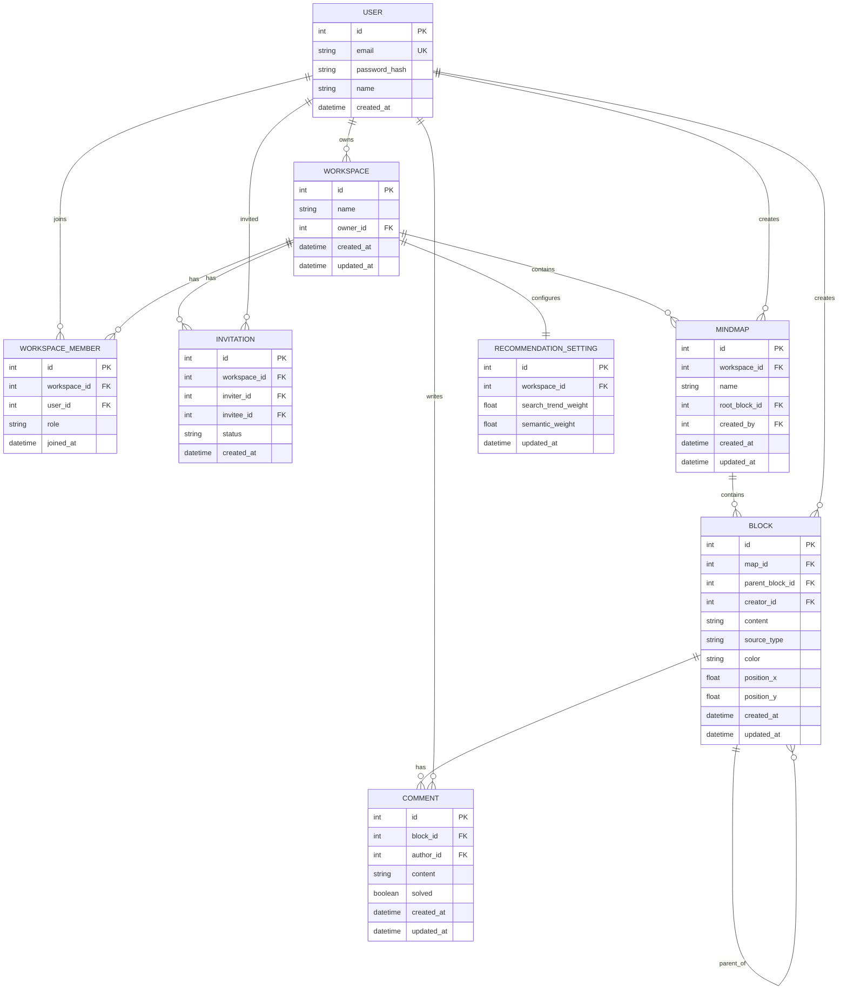

# 26s-w1-c2-01

## 공통과제 I : 웹 기반 프로젝트 (2인 1팀)

**목적:** 공통 과제를 함께 수행하며 웹 개발의 전체 흐름을 빠르게 익히고 협업에 적응하기

**결과물:** 기획부터 배포까지 완료된 웹 서비스와 관련 문서 일체

---

## 팀원

| 이름 | GitHub | 역할 |
|---|---|---|
|양우현|[@hyun020215](https://github.com/hyun020215)|  |
|김경원|[@kkw610](https://github.com/kkw610)|  |

---

## 기획안

- **주제:** 온라인 브레인스토밍 협업 툴
- **목적:** 웹 상에서 팀원들과 함께 자유롭게 의견을 나누고 브레인스토밍을 할 수 있도록 검색, 공유, 추천, 커스터마이징 등의 기능으로 사용자 보조
- **핵심 기능:** 하나의 워크스페이스 안에 여러 개의 브레인스토밍 트리(마인드맵)를 만들 수 있음. 각 마인드맵은 루트 노드에서 시작해 팀원들이 함께 아이디어 블록을 트리 형태로 확장하며, 모든 변경사항은 **실시간으로 동기화**됨
- **예상 사용자:** Ideation이 필요한 학생, 직장인 등

---

## 기능 명세서

### 필수 기능

- [ ] 회원가입 / 로그인 (ID + PW, JWT 기반 인증)
- [ ] 워크스페이스 생성 / 목록 조회 / 수정 / 삭제
- [ ] 워크스페이스 멤버 권한 3단계 (owner / editor / viewer) — viewer는 읽기 전용
- [ ] 유저 이메일 검색 및 워크스페이스 초대 / 수락·거절
- [ ] **마인드맵(브레인스토밍 트리) 생성/목록/삭제** — 워크스페이스 하나에 마인드맵 여러 개, 생성 시 이름과 동일한 루트 노드 자동 생성
- [ ] 아이디어 블록 생성 / 연결(재연결) / 삭제(하위 트리 전체 cascade) / 위치 이동
- [ ] 아이디어 블록 색상 지정 (8가지 프리셋 hex 값, 기본값 인디고)
- [ ] **워크스페이스/마인드맵 내 실시간 동기화** (WebSocket) - 블록 생성/삭제/이동/재연결이 다른 팀원 화면에 즉시 반영

### 선택 기능

- [ ] 자동 추천 (관련검색어 기반 / 사전적 유사어 기반)
- [ ] 추천 우선순위 커스터마이징 (검색어 가중치 vs 유사어 가중치)
- [ ] 노드(블록) 단위 코멘트, 해결 처리

---

## IA 및 화면 설계서

> 서비스의 전체 페이지 구조와 페이지 간 이동 흐름 정리 예정

- 로그인/회원가입 페이지
- 워크스페이스 목록/초대함 페이지
- 브레인스토밍 캔버스 페이지

<!-- Figma 링크 또는 이미지 첨부 -->

---

## DB 스키마

### ERD



### 테이블 상세

**User**
| 필드 | 타입 | 설명 |
|---|---|---|
| id | PK | |
| email | string, unique | 로그인 식별자. 이메일 형식 문자열이지만 인증 메일 발송/형식 검증은 하지 않음 — 프론트 로그인 화면의 `email` 필드와 그대로 매칭 |
| password_hash | string | bcrypt 해시 |
| name | string | 표시 이름 |
| created_at | datetime | |

**Workspace**
| 필드 | 타입 | 설명 |
|---|---|---|
| id | PK | |
| name | string | |
| owner_id | FK(User) | 생성자 |
| created_at / updated_at | datetime | |

**WorkspaceMember**
| 필드 | 타입 | 설명 |
|---|---|---|
| id | PK | |
| workspace_id | FK(Workspace) | |
| user_id | FK(User) | |
| role | enum(string) | `owner` / `editor` / `viewer` — 프론트 `MemberData.role`과 동일 |
| joined_at | datetime | |

**Invitation**
| 필드 | 타입 | 설명 |
|---|---|---|
| id | PK | |
| workspace_id | FK(Workspace) | |
| inviter_id | FK(User) | |
| invitee_id | FK(User) | |
| status | string | pending / accepted / rejected |
| created_at | datetime | |

**MindMap**
| 필드 | 타입 | 설명 |
|---|---|---|
| id | PK | |
| workspace_id | FK(Workspace) | 어느 워크스페이스 소속인지 |
| name | string | 마인드맵 이름 (프론트 `MapData.name`) |
| root_block_id | FK(Block), nullable | 이 마인드맵의 루트 노드. 마인드맵 생성 시 동일한 이름의 루트 블록도 함께 생성 |
| created_by | FK(User) | |
| created_at / updated_at | datetime | 프론트 `updatedAt`("2시간 전" 등)은 이 필드를 상대시간으로 프론트에서 변환해서 표시 |

**Block**
| 필드 | 타입 | 설명 |
|---|---|---|
| id | PK | |
| map_id | FK(MindMap) | 어느 마인드맵(트리)에 속하는지 |
| parent_block_id | FK(Block), nullable | 트리 구조. 삭제 시 하위 서브트리 전체 cascade 삭제 |
| creator_id | FK(User) | |
| content | string | 아이디어 워딩 (프론트 `NodeData.text`) |
| source_type | string | manual / recommended |
| color | enum(string) | 8가지 프리셋, 기본값 `indigo` |
| position_x / position_y | float | 캔버스 좌표 (프론트 `NodeData.x/y`) |
| created_at / updated_at | datetime | |

> **색상 프리셋**
> | enum 값 | hex |
> |---|---|
> | `indigo` | `#6366f1` |
> | `violet` | `#8b5cf6` |
> | `cyan` | `#06b6d4` |
> | `emerald` | `#10b981` |
> | `amber` | `#f59e0b` |
> | `red` | `#ef4444` |
> | `pink` | `#ec4899` |
> | `blue` | `#3b82f6` |

**Comment**
| 필드 | 타입 | 설명 |
|---|---|---|
| id | PK | |
| block_id | FK(Block), **not null** | 어느 노드에 대한 댓글인지 (프론트 `CommentData.nodeId`) |
| author_id | FK(User) | |
| content | string | |
| solved | boolean | |
| created_at / updated_at | datetime | |

**RecommendationSetting**
| 필드 | 타입 | 설명 |
|---|---|---|
| id | PK | |
| workspace_id | FK(Workspace), unique | 워크스페이스 단위 설정 (마인드맵마다 따로 두지 않음) |
| search_trend_weight | float (0~1) | 관련검색어 기반 추천 가중치 |
| semantic_weight | float (0~1) | 사전적 유사어 기반 추천 가중치 |
| updated_at | datetime | |

---

## API 문서

### Auth
| Method | Endpoint | 설명 | 요청 | 응답 |
|---|---|---|---|---|
| POST | `/api/v1/auth/signup` | 회원가입 | `email`, `password`, `name` | `id`, `email`, `name` |
| POST | `/api/v1/auth/login` | 로그인 | `email`, `password` | `accessToken`, `refreshToken`, `user` |
| POST | `/api/v1/auth/refresh` | 토큰 재발급 | `refreshToken` | `accessToken` |
| POST | `/api/v1/auth/logout` | 로그아웃 | 없음 | `message` |

### User
| Method | Endpoint | 설명 | 요청 | 응답 |
|---|---|---|---|---|
| GET | `/api/v1/users/me` | 내 정보 조회 | 없음 | `id`, `email`, `name` |
| GET | `/api/v1/users/search` | 유저 이메일 검색 (초대용) | `q` (query param) | `users[]` |

### Workspace / Member / Invitation
| Method | Endpoint | 설명 | 요청 | 응답 |
|---|---|---|---|---|
| POST | `/api/v1/workspaces` | 워크스페이스 생성 | `name` | `workspace` |
| GET | `/api/v1/workspaces` | 내 워크스페이스 목록 | 없음 | `workspaces[]` |
| GET | `/api/v1/workspaces/{workspaceId}` | 상세 조회 | 없음 | `workspace`, `members[]` |
| PATCH | `/api/v1/workspaces/{workspaceId}` | 수정 | `name` | `workspace` |
| DELETE | `/api/v1/workspaces/{workspaceId}` | 삭제 (owner만) | 없음 | `message` |
| POST | `/api/v1/workspaces/{workspaceId}/invite` | 초대 | `userId`, `role`(editor/viewer) | `invitation` |
| GET | `/api/v1/workspaces/{workspaceId}/members` | 멤버 목록 | 없음 | `members[]` |
| PATCH | `/api/v1/workspaces/{workspaceId}/members/{userId}` | 멤버 권한 변경 (owner만) | `role` | `member` |
| DELETE | `/api/v1/workspaces/{workspaceId}/members/{userId}` | 멤버 제거 | 없음 | `message` |
| GET | `/api/v1/invitations` | 받은 초대 목록 | 없음 | `invitations[]` |
| POST | `/api/v1/invitations/{invitationId}/accept` | 초대 수락 | 없음 | `message` |
| POST | `/api/v1/invitations/{invitationId}/reject` | 초대 거절 | 없음 | `message` |

### MindMap
| Method | Endpoint | 설명 | 요청 | 응답 |
|---|---|---|---|---|
| POST | `/api/v1/workspaces/{workspaceId}/maps` | 마인드맵 생성 (이름과 동일한 루트 블록 자동 생성) | `name` | `map` (root block 포함) |
| GET | `/api/v1/workspaces/{workspaceId}/maps` | 마인드맵 목록 | 없음 | `maps[]` (각 항목에 `nodeCount`, `updatedAt` 포함) |
| GET | `/api/v1/maps/{mapId}` | 마인드맵 상세 | 없음 | `map` |
| PATCH | `/api/v1/maps/{mapId}` | 이름 수정 | `name` | `map` |
| DELETE | `/api/v1/maps/{mapId}` | 삭제 (하위 블록/댓글 전부 cascade) | 없음 | `message` |

### Block
| Method | Endpoint | 설명 | 요청 | 응답 |
|---|---|---|---|---|
| POST | `/api/v1/maps/{mapId}/blocks` | 블록 생성 | `content`, `parentBlockId`, `positionX`, `positionY`, `color?` | `block` |
| GET | `/api/v1/maps/{mapId}/blocks` | 마인드맵 전체 블록 트리 조회 | 없음 | `blocks[]` |
| GET | `/api/v1/blocks/{blockId}` | 블록 상세 | 없음 | `block` |
| PATCH | `/api/v1/blocks/{blockId}` | 내용/색상 수정 | `content?`, `color?` | `block` |
| PATCH | `/api/v1/blocks/{blockId}/position` | 위치 이동 | `positionX`, `positionY` | `block` |
| PATCH | `/api/v1/blocks/{blockId}/parent` | 연결/부모 변경 | `parentBlockId` | `block` |
| DELETE | `/api/v1/blocks/{blockId}` | 삭제 (하위 서브트리 전체 cascade, 루트 블록은 삭제 불가) | 없음 | `message` |

### Comment *(선택 기능, 노드별)*
| Method | Endpoint | 설명 | 요청 | 응답 |
|---|---|---|---|---|
| POST | `/api/v1/blocks/{blockId}/comments` | 코멘트 생성 | `content` | `comment` |
| GET | `/api/v1/blocks/{blockId}/comments` | 해당 노드의 코멘트 목록 (사이드바용) | `solved?` (필터) | `comments[]` |
| PATCH | `/api/v1/comments/{commentId}` | 수정 | `content` | `comment` |
| PATCH | `/api/v1/comments/{commentId}/solved` | 해결 여부 변경 | `solved` | `comment` |
| DELETE | `/api/v1/comments/{commentId}` | 삭제 | 없음 | `message` |

### Recommendation *(선택 기능)*
| Method | Endpoint | 설명 | 요청 | 응답 |
|---|---|---|---|---|
| GET | `/api/v1/blocks/{blockId}/recommendations` | 해당 블록 기반 추천 결과 조회 (캐시 or 재요청) | `limit?` | `recommendations[]` |
| POST | `/api/v1/blocks/{blockId}/recommendations/apply` | 추천 항목을 실제 블록으로 확정 | `content` | `block` |
| GET | `/api/v1/workspaces/{workspaceId}/recommendation-settings` | 우선순위 설정 조회 | 없음 | `settings` |
| PATCH | `/api/v1/workspaces/{workspaceId}/recommendation-settings` | 우선순위 설정 수정 | `searchTrendWeight`, `semanticWeight` | `settings` |

### WebSocket
| Endpoint | 설명 |
|---|---|
| `WS /api/v1/ws/maps/{mapId}` | **마인드맵(캔버스) 단위** 실시간 채널 (접속 시 JWT 인증) |

---

## 배포 결과물

- **서비스 URL:**
- **실행 방법:**

```bash
# 실행 방법 작성
```

---

## 회고 문서

### Keep

### Problem

### Try

---

## 참고 자료

- [SDD(스펙 주도 개발) 이해하기](https://news.hada.io/topic?id=21338)
- [Software Design Document Best Practices](https://www.atlassian.com/work-management/project-management/design-document)
- [IA 정보구조도 작성 방법](https://brunch.co.kr/@nyonyo/7)
- [기획자 화면설계서 작성법](https://brunch.co.kr/@soup/10)
- [Figma 와이어프레임 가이드](https://www.figma.com/ko-kr/resource-library/what-is-wireframing/)
- [무료 Figma 와이어프레임 키트](https://www.figma.com/ko-kr/templates/wireframe-kits/)
- [ERD/DB 설계 총정리](https://inpa.tistory.com/entry/DB-%F0%9F%93%9A-%EB%8D%B0%EC%9D%B4%ED%84%B0-%EB%AA%A8%EB%8D%B8%EB%A7%81-%EA%B0%9C%EB%85%90-ERD-%EB%8B%A4%EC%9D%B4%EC%96%B4%EA%B7%B8%EB%9E%A8)
- [API 명세서 작성 가이드라인](https://velog.io/@sebinChu/BackEnd-API-%EB%AA%85%EC%84%B8%EC%84%9C-%EC%9E%91%EC%84%B1-%EA%B0%80%EC%9D%B4%EB%93%9C-%EB%9D%BC%EC%9D%B8)
- [좋은 README 작성하는 방법](https://velog.io/@sabo/good-readme)
- [단기 프로젝트 회고 KPT 방법론](https://velog.io/@habwa/%EB%8B%A8%EA%B8%B0-%ED%94%84%EB%A1%9C%EC%A0%9D%ED%8A%B8-%ED%9A%8C%EA%B3%A0-KPT-%EB%B0%A9%EB%B2%95%EB%A1%A0)
